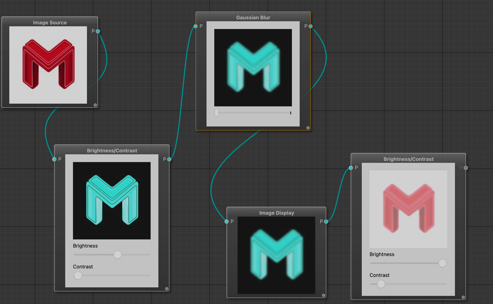
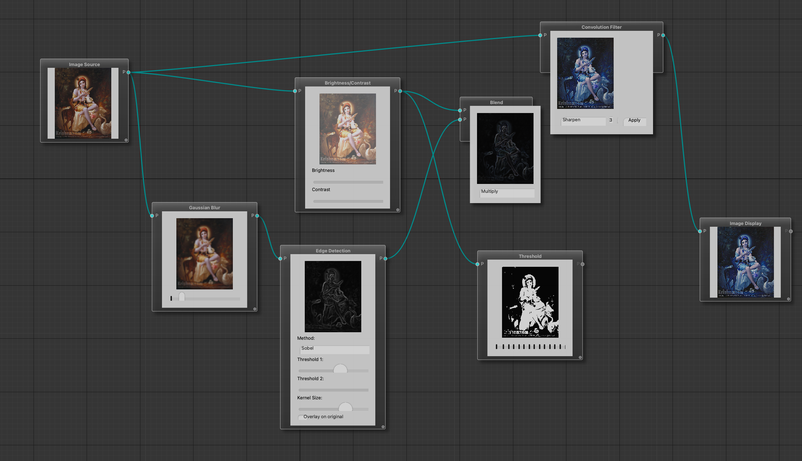

# Node-Based Image Editor




## ✨ Features

- ✅ **Load and preview images**
- ✅ **Visual node editor (QtNodes-based)**
- ✅ **Live image preview in each node**
- ✅ **Brightness & Contrast adjustments**
- ✅ **Gaussian Blur (with configurable radius)**
- ✅ **Thresholding (binary image)**
- ✅ **Edge Detection (Sobel & Canny, configurable)**
- ✅ **Blend two images (normal, multiply, overlay, etc.)**
- ✅ **Noise generation (Perlin, Simplex, Worley)**
- ✅ **Convolution filter with 3x3 or 5x5 kernel**
- ✅ **Preset filters (sharpen, emboss, edge enhance)**
- ✅ **Dynamic parameter adjustment (sliders, dropdowns)**
- ✅ **Tooltips showing image details and metadata**


## 📸 Example Use Case

1. Load an image using the **Image Loader Node**.
2. Add a **Brightness/Contrast Node** and connect it to the loader.
3. Add a **Blur Node**, tweak the radius using the slider.
4. Add an **Edge Detection Node**, choose between Sobel or Canny.
5. Optionally overlay the edges over the original image.
6. Preview outputs in each node!

## 🧱 Project Structure

examples/resizable_images/
│
├── main.cpp                          # Application entry point
├── PixmapData.hpp                    # Shared image container between nodes
│
├── ImageLoaderModel.hpp/cpp         # Loads image from file
├── ImageShowModel.hpp/cpp           # Displays processed image
│
├── BrightnessContrastModel.hpp/cpp  # Adjust brightness and contrast
├── GaussianBlurModel.hpp/cpp        # Apply Gaussian blur
├── ThresholdModel.hpp/cpp           # Convert image to binary
├── EdgeDetectionModel.hpp/cpp       # Sobel/Canny detection + overlay
├── BlendModel.hpp/cpp               # Blends two images
├── NoiseGenerationModel.hpp/cpp     # Generates procedural noise
├── ConvolutionFilterModel.hpp/cpp   # Apply custom/preset kernels


---

## ⚙️ Dependencies

- **Qt 6 (or 5)** (Widgets, Core, Gui)
- **OpenCV** (image processing)
- **QtNodes** (node editor framework)

Install on macOS (via Homebrew):

```bash
brew install qt opencv

## 🛠️ Build Instructions

### Clone the repository:

```bash
git clone [https://github.com/Vasudev-Majhi/node-based-image-processor_in_cpp.git](https://github.com/Vasudev-Majhi/node-based-image-processor_in_cpp.git)
cd node-based-image-processor/examples/resizable_images


### Create build directory:

```bash
mkdir build && cd build

### Run cmake and make
```bash
cmake ..
make

### Run the application
./resizable_images


### 🧩 Adding New Nodes

To add a new node:

#### Create your model files:

Example: `YourNodeModel.hpp` and `YourNodeModel.cpp`

#### Inherit from `NodeDelegateModel`.

#### Implement required virtual functions:

- `caption()`
- `modelName()`
- `nPorts()`
- `dataType()`
- `setInData()`
- `outData()`
- `embeddedWidget()`
- (Optional) Add sliders, combo boxes or preview widgets using Qt inside `embeddedWidget()`.

#### Register your node in `main.cpp`:

```cpp
ret->registerModel<YourNodeModel>();
